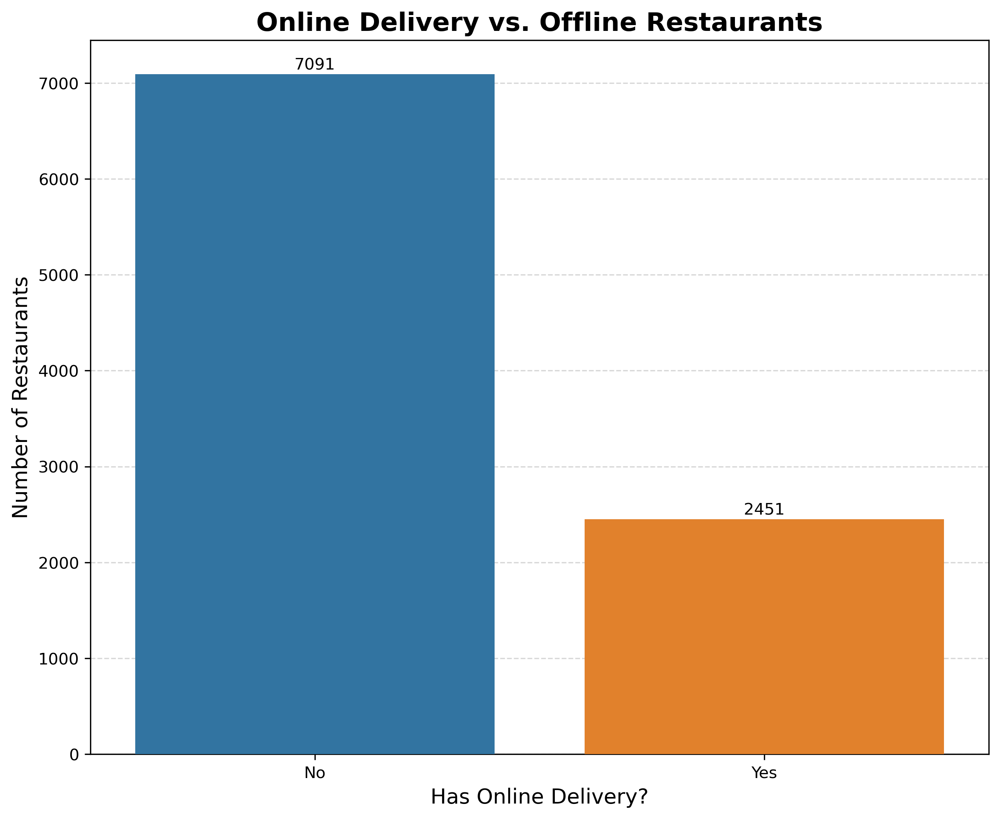

# zomato-restaurant-eda
Exploratory Data Analysis (EDA) of Zomato restaurant dataset with Python, Pandas, Matplotlib, and Seaborn — visualizing trends in ratings, price ranges, cuisines, and more.


# Zomato Restaurants EDA Project


## 📌 Project Overview
This project explores the **Zomato Restaurants Dataset** to uncover insights about restaurant trends, customer preferences, and business opportunities. The analysis focuses on key metrics like online delivery availability, city-wise restaurant distribution, and other factors influencing the food industry.

## 📊 Dataset
- **Source:** [Zomato Restaurants Dataset - Kaggle](https://www.kaggle.com/datasets/shrutimehta/zomato-restaurants-data)
- **Size:** 9,551 restaurants × 21 features
- **Key Features:** 
  - Restaurant ID/Name
  - Location (City/Country/Address)
  - Cuisines
  - Average Cost
  - Aggregate Rating
  - Votes
  - Online Delivery Availability

## 🔍 Key Insights

### 1. Online Delivery vs. Offline Restaurants

- Significant portion of restaurants offer online delivery
- Many still operate offline, indicating growth potential for digital ordering platforms

### 2. Top Cities with Most Restaurants
- Clear dominance by a few metropolitan areas
- High competition in top cities, but also reflects strong customer demand

### 3. Rating Analysis
- Most restaurants cluster around 3-4 rating range
- Few achieve "Excellent" (4.8+) ratings

## 🛠️ Technical Implementation
```python```
# Key Libraries
import pandas as pd
import matplotlib.pyplot as plt
import seaborn as sns

# Data Loading
df = pd.read_csv('zomato.csv', encoding='latin-1')


# Online Delivery Analysis
delivery = df.value_counts('Has Online delivery').reset_index(name='count')
sns.barplot(data=delivery, x='Has Online delivery', y='count')


# 📂 File Structure

Zomato_EDA/
```├── Zomato_EDA.ipynb```       # Main analysis notebook
```├── zomato.csv```             # Dataset
```├── README.md```              # Project documentation
```└── barplot_Has_online_deliver.png```  # Output visualization

# 💡 Business Applications
- ```For Restaurant Owners:```

- Optimize pricing based on location trends

- Improve ratings by analyzing high-performing restaurants

- Consider adding online delivery services
```For Investors:```

- Identify high-potential locations for new ventures

- Spot emerging cuisine trends

```For Food Enthusiasts:```

- Discover top-rated dining options

- Understand city-wise food scenes

 # 🤝 How to Contribute
- Fork the repository

- Create your feature branch (git checkout -b feature/AmazingFeature)      

- Commit your changes (git commit -m 'Add some AmazingFeature')

- Push to the branch (git push origin feature/AmazingFeature)

- Open a Pull Request

# 📜 License
- Distributed under the MIT License. See LICENSE for more information.

 # ✉️ Contact
[waleed Afridi] - [paltu7150gmail.com]
Project Link: https://github.com/WaleedAfridi-1/zomato-restaurant-eda
